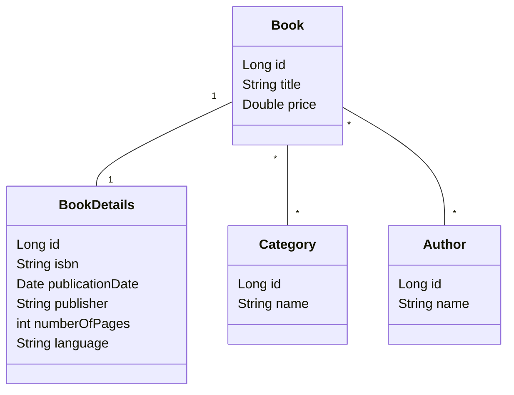
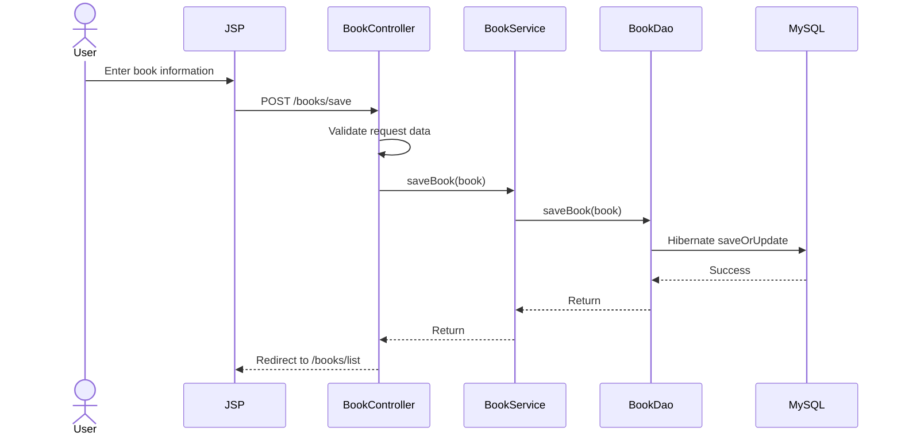

# Amazon Book Store

A simple Library Management System built with Spring MVC, Hibernate, MySQL, Maven, JSP, HTML/CSS and Bootstrap.

The application manages books, book details, categories and authors through a layered Spring MVC architecture.

## Features

- Create, view, update and delete books.
- Store additional book information such as ISBN, publisher, number of pages and language.
- Manage categories independently from books.
- Manage authors independently from books.
- Link books to multiple categories and multiple authors.
- Keep books when a linked category or author is deleted by removing only the relationship.
- Display book covers automatically from ISBN when a cover is available.
- Backend validation for required names, book title and book price.
- Category pagination.
- Responsive JSP interface styled with Bootstrap and custom CSS.

## Technologies Used

- Java 8
- Spring Core
- Spring MVC
- Spring ORM
- Hibernate ORM
- MySQL
- Maven
- JSP / JSTL
- HTML / CSS
- Bootstrap 4
- Git / GitHub
- Apache Tomcat

## Project Architecture

```text
User
  |
JSP + Bootstrap
  |
Spring MVC Controller
  |
Service
  |
DAO
  |
Hibernate
  |
MySQL
```

## Database Design

The current project uses the following relationships:

- `Book` ↔ `BookDetails`: One-to-One
- `Book` ↔ `Category`: Many-to-Many through `book_category`
- `Book` ↔ `Author`: Many-to-Many through `book_author`

Main tables:

```text
book
- id
- title
- price

book_details
- id
- isbn
- publication_date
- publisher
- number_of_pages
- language
- book_id

category
- id
- name

author
- id
- name

book_category
- book_id
- category_id

book_author
- book_id
- author_id
```

## UML Class Diagram



## Sequence Diagram

Example flow for saving a book:



## Feature Branches

The project is organized feature by feature:

- `feature/category` - Category DAO, Service, Controller and JSP pages.
- `feature/author` - Author DAO, Service, Controller and JSP pages.
- `feature/book` - Book DAO, Service, Controller and JSP pages.

Each feature is reviewed through a Pull Request before being merged into `main`.

## How to Run the Project

1. Install Java 8, Maven, MySQL and Apache Tomcat.
2. Create a MySQL database named:

```sql
CREATE DATABASE amazon_db;
```

3. Open `src/main/webapp/WEB-INF/application-context.xml`.
4. Replace `YOUR_MYSQL_PASSWORD` with your local MySQL password.
5. Import the project as a Maven project in IntelliJ IDEA or another Java IDE.
6. Let Maven download the dependencies.
7. Configure Apache Tomcat.
8. Run the application.
9. Open the deployed application in the browser. The root page redirects to the Books page.

Hibernate is configured with `hibernate.hbm2ddl.auto=update`, so the mapped tables are created or updated automatically when the application starts.

## Main Routes

```text
/books/list
/books/add
/books/edit?id={id}
/books/details?id={id}

/categories/list
/categories/add
/categories/edit?id={id}

/authors/list
/authors/add
/authors/edit?id={id}
```

## Screenshots

Screenshots of the Books, Categories, Authors, forms and Book Details pages can be added here before the final submission.

## Git Workflow

The repository uses meaningful commits and separate feature branches so the project can be reviewed feature by feature before merging into `main`.
